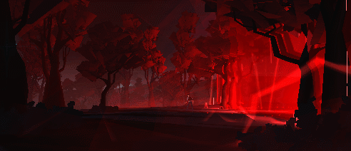

<picture>
 
</picture>

## About me

𝙏𝙃𝙀 𝙂𝙊𝘼𝙏 🐐 young programmer, self-taught person, 𝙐𝙉𝙄𝙑𝙀𝙍𝙎𝙄𝙏𝙔 𝙞𝙨 𝙨𝙤 𝙁𝙐𝘾𝙆𝙄𝙉𝙂 𝙀𝘼𝙎𝙔

---
> 𝔽𝕌ℂ𝕂 𝕒𝕟 𝔸ℙ𝕆𝕃𝕆𝔾𝕐, 𝕀'𝕞 ℕ𝕆𝕋 𝕊𝕆ℝℝ𝕐 𝕗𝕠𝕣 𝕒𝕟𝕪𝕥𝕙𝕚𝕟𝕘
---

### Skills

| Rank | Languages | Frameworks | Libraries  | Code Quality |
|-----:|-----------|------------|------------|--------------|
|     1| Python    | React      | Pandas     | SonarQube    |
|     2| Java      | Django     | Numpy      | PMD          |
|     3| Javascript| Spring     | Tensorflow | Pylint       |
|     4| C#        | hibernate  | JavaFx     | Jmeter       |

<picture>
 
</picture>
